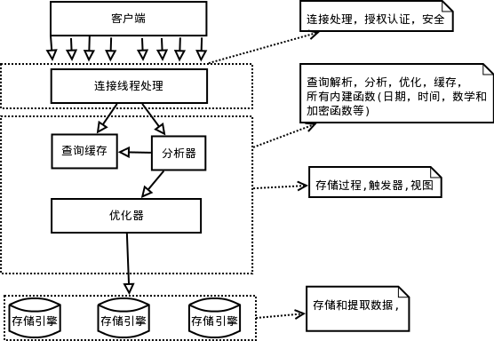

## mysql 逻辑架构图


## 1.2 并发控制

* 共享锁(读锁) 互不阻塞 。 排他锁(写锁) 会阻塞其他的 写锁 和读锁
* 表锁(table lock)  0_0 尽管存储引擎可以管理自己锁，MySQL 还会使用各种有效的表锁, 如 ALTER TABLE 之类的表锁，忽略存储引擎的锁机制
* 行级锁 (row lock) InnoDB 和 XtraDB,及其他一些存储引擎实现了行级锁

## 1.3 事物

开启事物 
```mysql
START TRANSACTION; && begin; 
COMMIT;
ROLLBACK;   -- 回退
```

* 原子性(atomicity)
* 一致性(consistency)
* 隔离性(isolation)
* 持久性(durability)

### 隔离级别

* READ uncommitted (未提交读)
    * 事物的修改，即使没有提交，对其他事物也都是可见的
* read committed (提交读)
    * 一个事物开始直到提交前， 所做的任何修改对其他事物都是不可见的，这级别也叫 ``不可重复读(nonrepeatable read)``
* repeatble read (可重复读)
    * InnoDB 和 XtraDB 通过多版本并发控制(MVCC, Multiversion Concurrency Control) 解决幻读问题
* serializable (可串行化)

