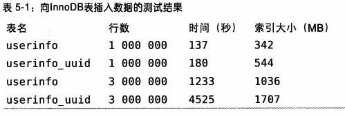
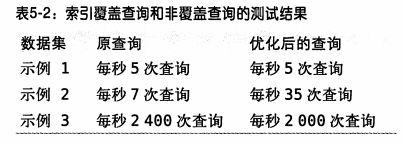
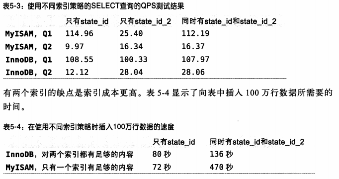

## 1. 独立的列

```sql
无法使用 索引
 mysql > select actor_id FROM sakil.actor where actor_id + 1 = 5; 

 ```


 ## 4. 选择适合的索引列 顺序
 ```sql 
 计算 查询选项或索引 的行数，， 将 行数 少的放 前列
 mysql > select SUM(staff_id = 2), SUM(customer_id=584) FROM payment

SUM(staff_id = 2) : 7777
SUM(customer_id=584) : 40


索引前列， 计算公式
mysql > SELECT COUNT(DISTINCT staff_id)/COUNT(*) AS staff_id_selectivity,
     > COUNT(DISTINCT customer_id) /COUNT(*) AS customer_id_selectivity,
     > COUNT(*)
     > FROM payment\G

pt-query-digest 慢分析工具
 ```


 ## 5. 聚簇索引

### 定义 ： 不是一种索引类型，是一种数据存储方式

#### InnoDB 和 MyISAM 的数据分布对比

P171 
MyISAM 按照数据插入顺序存储的磁盘上， 从0开始递增。 创建的 索引类似 树中， 节点 和 子叶节点 的 “行号”， 树中的节点 对于 顺序磁盘上的行号

InnoDB ： 一条数据 含有 主键列(col1) , 事务id， 回滚指针， 非主键列(col2) . 使用 B-tree 存储 key是 主键， value 是行的数据

#### UUID 和 ID(int unsigned) 比较

插入 400 万条 的 记录



主键字段更长，页分裂和碎片导致

## 6 覆盖索引

1. 优点很多。减少 IO 查询， 减少数据访问量，利用缓存
2. `EXPLAIN 的 Extra 列可以看到 “Using index” 的信息`

**例子**
```sql

-- 该查询无法使用 覆盖索引（查询 actor , 在 like） 和 索引中 执行 LIKE 操作
mysql > explain SELECT * FROM TALBUE WHERE actor="whchao" and title like '%paly%'


--重写该语句, 比较先 覆盖索引， 
mysql > explain SELECT * FROM Table JOIN (
    SELECT t_id FROM Table where  actor="whchao" and title like '%paly%'
) AS t1 ON (t1.t_id = Table.t_id)

 ```

样本 3000，2000 && 3000， 40， 50 10



## 7 使用索引扫描来做 排序


```sql

-- 用 order by 做引索  ， P175
mysql > EXPLAIN select rental_id from table where rental_data = '2005-05-25'
      > ORDER BY inventory_id, customer_id\G

```


## 9 冗余和重复索引

1. UNIQUE(ID), INDEX(ID) 都是通过 索引实现
2. 解决 冗余和重复索引 --- 删除这些索引就行了
3.  联合索引 对于 insert 和 select 的测试结果



## 10 未使用的索引

未使用的索引建议删除
用两个工具 可以帮助定位 未使用的索引， 使用 Percona Server 或 MariaDB 中先打开 userstates 服务器变量，过段时间，在查看 INFORMATION_SCHEMA.INDEX_STATISTICS 就查看看到每个 索引 使用的频率


## 11 索引和锁

Extra "Using where" 表示 Mysql 服务器将存储引擎返回后在应有 WHERE 过滤条件
