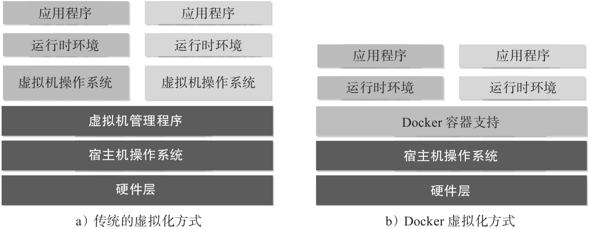

# docker 基本操作

### 传统虚拟化方式 和 Docker 虚拟化方式

## docker 安装

[docker](https://www.docker.com/)

## docker 商店
 [docker stroe](hub.docker.com)

 ## 镜像命令

docker images

 ## 容器命令

 docker ps
 docker ps -a

 ## Dockerfile 使用

端口号:  netstat -na|grep

window
docker run -d -P --name web -v c:/one/test:/var/www -p 8088:80  -p 3307:3306 -p 10122:22 hub.c.163.com/public/lamp

进入 Linux
 docker exec -it 243c32535da7  /bin/bash